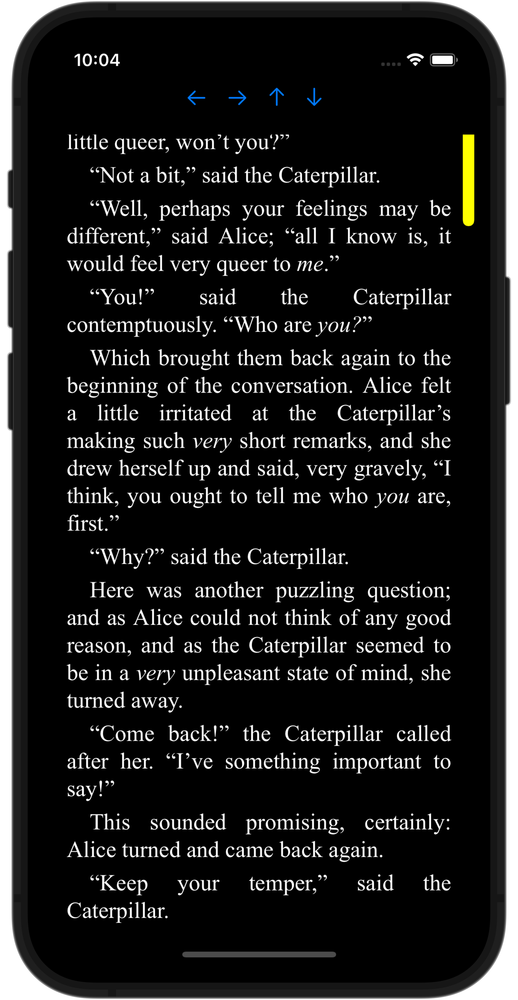

# EbookReader

<div align="center">
  
</div>

EbookReader is, guess what, an _ebook_ _reader_ for iOS made with SwiftUI. 

A while ago, I had a need to read Epub files for a personal project and iOS didn't have a native way to do it. Dependencies like FolioReaderKit were already obsolete and came with a lot of extra functionality that wasn't necessary for me, so EbookReader was born, a simple epub reader!

<video src="assets/example-ebook.mp4"></video>

## Features

- Supports reading ePub files
- Customizes the background color, text color, and text size
- Saves the offset where the reading stopped so that, when returned, the reading will begin from where it left off.
- Displays a progress indicator showing the currently read position with respect to the remaining portion of the chapter.

## Requirements

- iOS 14.0+
- SwiftUI

## Usage

1) Create an instance of `EbookReaderView` within your app.
2) Call the `loadBook` method from `EbookReaderManager` singleton using your chosen book.
3) Voila! Your book is loaded and ready for reading.

```swift
import EbookReader

struct ExampleView: View {
    private let myBookURL = Bundle.main.url(forResource: "alice", withExtension: "epub")
    // ...
    var body: some View {
        VStack {
            // ...
            EbookReaderView()
        }
        .onAppear {
          	EbookReaderManager.shared.loadBook(from: myBookURL)
        }
    }
}
```

To navigate programmatically after loading your book, you can perform the following actions:

```swift
EbookReaderManager.shared.goForward() // To navigate to the next page

EbookReaderManager.shared.goBack() // To return to the previous page

EbookReaderManager.shared.scrollUp() // To scroll up within the page

EbookReaderManager.shared.scrollDown() // To scroll down within the page
```
You can check the `Demo` folder for a comprehensive example

## Installation

### Swift Package Manager

Add the following dependency to your `Package.swift` file:

```swift
dependencies: [
    .package(url: "https://github.com/dancarvajc/EbookReader.git", from: "0.1.0")
]
```

Then, add `YourPackage` to your target dependencies:

```swift
.target(
    name: "YourTarget",
    dependencies: [
        "EbookReader"
    ]),
```

## Credits

Thanks to @stonezhl for providing the [Bookbinder](https://github.com/stonezhl/Bookbinder) package

